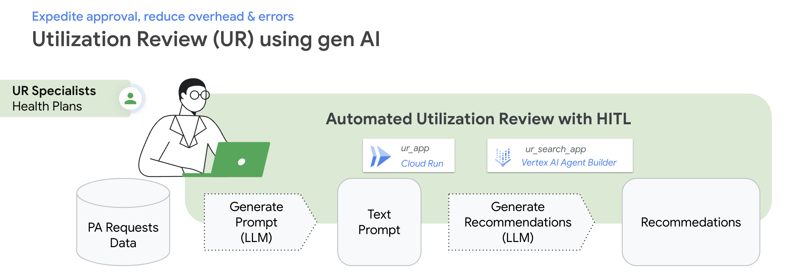

# Utilization Review using Generative AI

Demonstrates use of Generative AI to streamline Utilization Review process in Healthcare. 



## Prerequisite
You should complete the following three steps before you start deploying the App.

1. You need a few PDF documents in a Google Cloud Storage (GCS) Bucket in your GCP Project.
 
2. Create a Cloud Storage Data Store in the Vertex AI Agent Builder to ingest PDF documents from the GCS Bucket. [Here are the instructions](https://cloud.google.com/generative-ai-app-builder/docs/create-data-store-es#cloud-storage) to create a Cloud Storage Data Store in the Vertex AI Agent Builder.

3. Create a Search App in the Vertex AI Agent Builder to implement Search and Summarization over the PDF documents. [Here are the instructions](https://cloud.google.com/generative-ai-app-builder/docs/create-engine-es) to create a Search App in your GCP Project.

## Deploy Locally
Set environment variables:
```commandline
export GOOGLE_CLOUD_PROJECT=[your-project-id]
export SEARCH_DATASTORE_ID=[your-search-datastore-id]
export LOCATION=[your-search-datastore-region]
export SEARCH_APP_ID=[your-search-app-id]
export LLM_LOCATION=[your-LLM-region]
export LLM=[your-LLM]
```

Install dependencies
```commandline
pip install -r requirements.txt
```

Authenticate to your GCP Project
```commandline
gcloud auth application-default login 
```

Launch
```commandline
streamlit run src/Home.py
```

## Deploy to Cloud Run
Set environment variables
```commandline
export AR_REPO=[your-ar-repo-name]
export AR_REPO_LOCATION=[your-ar-repo-region]
export SERVICE_NAME=[your-app-name]
```

Create Artifact repository in your GCP Project. 
<span style="color:red">**You can skip this if a repository already exist!**</span>
```commandline
gcloud artifacts repositories create "$AR_REPO" --location="$AR_REPO_LOCATION" --repository-format=Docker
```

Build the app and save it in the Artifact repository
```commandline
./build.sh
```

Deploy the app from the Artifact repository to Cloud Run
```commandline
./deploy.sh
```

Test locally using Cloud Run proxy
```
./run_proxy.sh
```